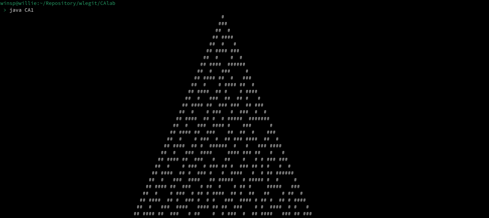

# CAlab - A labratory for Cellular Automata
This is a series of programs that can compute/simulate different kinds of Cellular Automata (CA).

At the moment only one-dimensional CA's can be computed, with the CA1.java file, but I plan to work on 2 and 3 dimensional CA programs in the future.

## A bit of CA theory
All cellular automata can the thought of as a 5 tuple:
 1. A set of cells called the __grid__
 2. A set of __states__ (which the cells can have)
 3. A __starting grid__ 
 4. A __rule__ that specifies how certain subsets of cells should change over time
 5. A __neighbourhood__ specifying the subset of cells in the grid to which the rule applies

A CA computes when the rule is applied to each cell in the gird, and after the new state of each cell has been determined, all cells are updated at once. This can be repeated as many times an one wants.

An interesing fact to note is that the number of possible rules a CA can have is determined by:
>nr. of possible rules = k<sup>k<sup>s</sup></sup>

where
> k = nr. of states, and \
> s = nr. of cells in the neighbourhood


## Guide: CA1.java
The code should be pretty well documented, but if anything is unclear please let me know.

CA1.java can be used to simulate any 1-dimensional CA. To see how this is done, let's look at an example:
```java
public static void main(String[] args)
{
  /* A grid is defined, represented by an array of integers. In this case the grid consists of only 145 cells */
  int[] state= new int[145];
  /* The number of states is defined and the gird is initialized. In this case we will represent 
  the first state with a 0 (int) and the second state with a 1 (int) */
  int nrOfStates = 2;
  /* The starting grid is is initialized */
  state[73] = 1;
  /* A rule is represented by a number corresponding to the same number in the base of nrOfStates (binary in this case) */
  int[] ruleA = {0, 1, 1, 1, 1, 0, 0, 0};
  /* The neighbourhood indicates which cells are used by the rule when applied to a specific cell
  by indicating the distance to the cell in the neighbourhood, relative to the cell to which the 
  rule is currently being applied. In this case the neighbourhood will be the cell to the current 
  cell's immediate left, itself, and its immediate right */
  int[] neighbourhood = {-1, 0, 1};

  /* We can now combine these things into an object of the CA1 class, which makes a 1-dimensional CA */
  CA1 rule_30 = new CA1(neighbourhood, nrOfStates, ruleA, state);
}
```
To see what happens when the CA computes, one can add the following code:
```java
char[] printChars = {' ', '#'}; // ' ' represents 0, and
                                // '#' represents 1
/* This computes and prints rule_30 for 30 timesteps */
for (int generation = 0; generation <30; generation++) {
    rule_30.printState(printChars);
    System.out.println();
    rule_30.updateState();
}
```
This will be the result:


